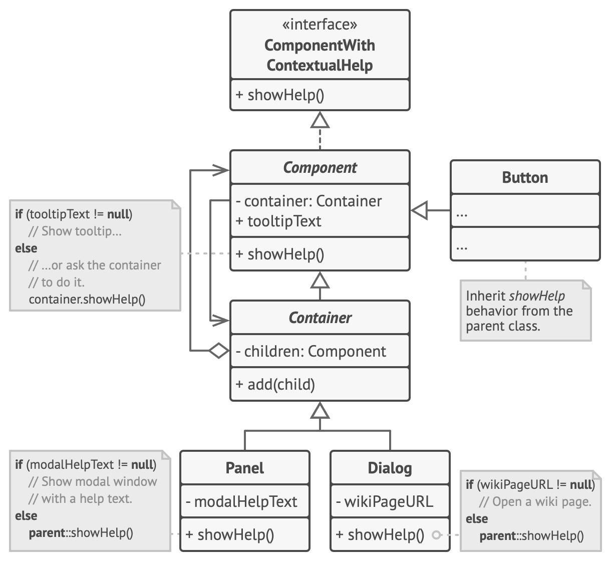

# Chain of responsibility

> Allows passing request along the chain of potential handlers until one of them handles request.

Complexity: :star::star::heavy_minus_sign:

Popularity: :star::star::heavy_minus_sign:

