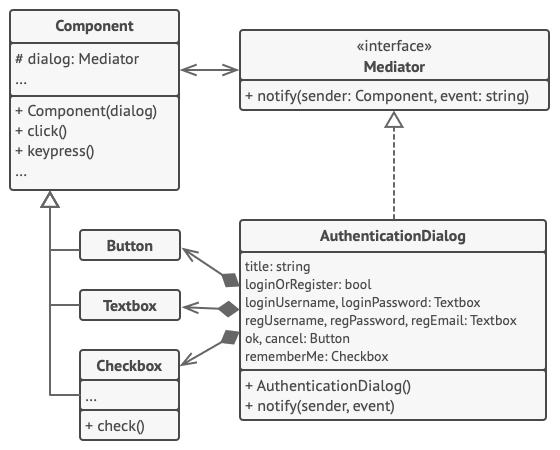

# Mediator

> Reduces coupling between components of a program by making them communicate indirectly, through a special mediator object.

Complexity: :star::star::heavy_minus_sign:

Popularity: :heavy_minus_sign::heavy_minus_sign::heavy_minus_sign:

