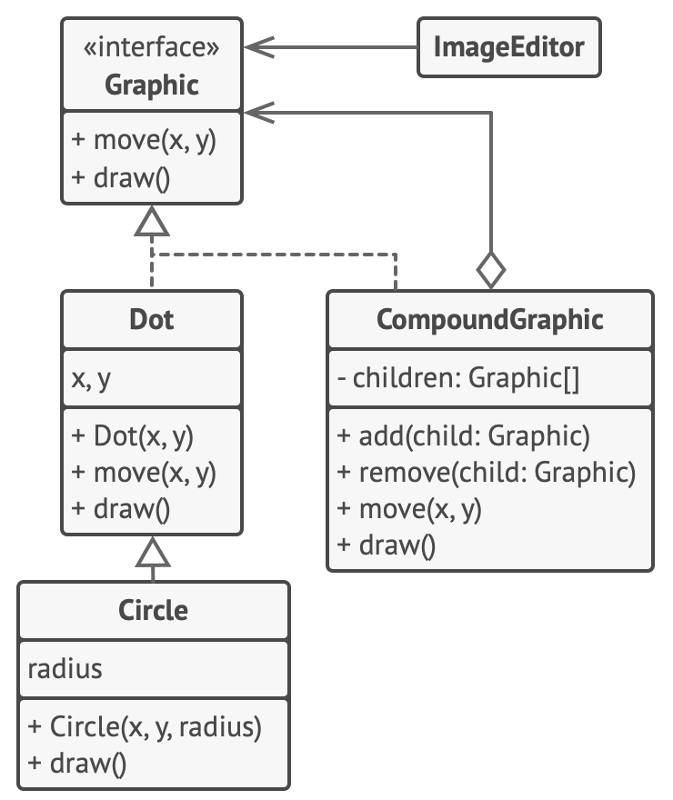

# Composite

> Allows composing objects into a tree-like structure and work with the it as if it was a singular object.

Complexity: :star::star::heavy_minus_sign:

Popularity: :star::star::heavy_minus_sign:

